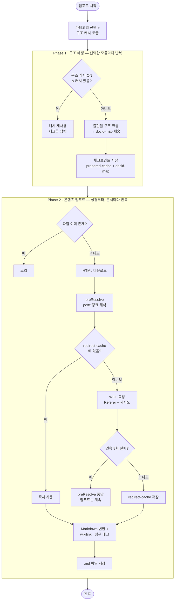

# org-to-obsidian

jw.org 및 WOL(Watchtower Online Library)의 한국어 콘텐츠를 Obsidian Vault로 임포트하는 Node.js 스크립트입니다.

## 소개

- **15종 콘텐츠 임포트**: 서적, 성경, 파수대, 깨어라, 통찰, 집회 교재, 영상 자막 등
- **내부 링크 자동 변환**: WOL HTML의 모든 참조를 Obsidian wikilink(`[[path|text]]`)로 변환
- **성구 인라인 태그**: 성경 참조 옆에 `#성구/창세기/3/15` 형태의 계층 태그 자동 생성
- **웹 UI**: 브라우저에서 카테고리/항목 선택 + 실시간 로그

### 작동 원리

#### 2단계 처리 파이프라인

**Phase 1 — docId 매핑 구축**
1. WOL 루트 페이지에서 각 섹션(서적, 파수대 등)의 현재 URL을 동적으로 해석
2. 선택된 카테고리의 출판물 구조를 크롤링
3. 각 문서의 docId와 Vault 파일 경로를 매핑하여 `docid-map.json`에 저장

**Phase 2 — 콘텐츠 임포트**
1. 각 문서의 HTML을 WOL에서 가져옴
2. HTML을 Markdown으로 변환 (cheerio 파싱)
3. 내부 `<a>` 태그를 wikilink로 변환 (Phase 1의 매핑 활용)
4. 성경 참조에 인라인 태그 추가
5. `/wol/pc/`, `/wol/tc/` 리다이렉트 링크를 배치로 해결
6. `.md` 파일로 저장 (이미 존재하는 파일은 스킵)

#### 진행 흐름도



> Phase 1은 선택한 **모든** 모듈을 먼저 매핑한 뒤에야 Phase 2로 넘어갑니다. 그래서 성경의 연구 자료 링크가 다른 출판물로 연결되려면 그 출판물도 **같은 실행에서 함께** 선택해야 합니다.

#### 데이터 소스

| 소스 | 용도 |
|---|---|
| `b.jw-cdn.org` | JWT 토큰, 영상 카테고리/자막 |
| `wol.jw.org` | 출판물 구조, 문서 HTML, 성경 |

언어는 한국어(`KO`, `r8/lp-ko`)로 고정되어 있습니다.

#### 캐시 파일

| 파일 | 용도 | 비고 |
|---|---|---|
| `docid-map.json` | docId ↔ Vault 경로 매핑 | Phase 1에서 자동 생성/갱신 |
| `redirect-cache.json` | WOL 리다이렉트 결과 캐시 | 네트워크 요청 절약 (수 만 건) |
| `book-name-map.json` | 성경 책이름 → 번호 매핑 | 성경 임포트 시 자동 생성 |
| `prepared-cache.json` | Phase 1 구조 크롤 결과 | 구조 캐시 토글 시 재크롤 생략 |

### 프로젝트 구조

```
├── server.js          # HTTP 서버 (웹 UI + SSE 로그 + 임포트 API)
├── import-runner.js   # 임포트 오케스트레이션 (server/CLI 공용)
├── update.js          # 정기 업데이트 CLI (cron 스케줄링용)
├── main.js            # CLI 진입점 (영상/서적/통찰, 구버전)
├── index.html         # 웹 UI (카테고리 선택 + 실시간 로그)
├── constant.js        # Vault 경로 상수
├── requests.js        # jw.org/WOL API 요청 (axios)
├── docid-map.js       # docId 매핑, HTML→MD 파싱, 링크 변환, 성구 태그
├── wol-sections.js    # WOL 섹션 URL 동적 해석
├── importers/         # 카테고리별 임포터 (15종)
│   ├── video.js
│   ├── books.js
│   ├── bible.js
│   ├── insight.js
│   ├── watchtower.js
│   ├── awake.js
│   ├── meeting.js
│   ├── kingdom-service.js
│   ├── programs.js
│   ├── brochures.js
│   ├── tracts.js
│   ├── web-series.js
│   ├── guidelines.js
│   ├── glossary.js
│   └── wol-index.js
├── docid-map.json      # [자동 생성] docId 매핑 캐시
├── redirect-cache.json # [자동 생성] 리다이렉트 캐시
├── book-name-map.json  # [자동 생성] 성경 책이름 매핑
├── prepared-cache.json # [자동 생성] Phase 1 구조 크롤 캐시
└── tag-vault-folder.js # 내 노트 성구 태깅 도구
```

## 사용법

### 준비 (최초 1회)

```bash
npm install
```

`constant.js`에서 Vault 경로만 본인 것으로 바꿉니다:

```js
export const VAULT_BASE = "/path/to/your/Obsidian Vault/";
```

### 세 가지 상황

#### 1. 전체 임포트 (처음)

```bash
npm start          # = node server.js
```

브라우저에서 `http://localhost:3000` → **✅ 모두 선택** → **임포트 시작**.

> 💡 성경을 꼭 포함하세요 — 성구 태그·링크의 기준이 됩니다.

#### 2. 정기 업데이트 (새 호수·기사만 빠르게)

새로 나온 파수대·집회 교재 등만 최신화할 때. 둘 중 편한 방법:

```bash
npm run update     # = node update.js  (브라우저 없이, cron 자동화 가능)
```

또는 웹 UI에서 상단 **🔄 정기 업데이트** 버튼 → **시작**.

기본 대상은 **영상·파수대·집회 교재**입니다. 특정 카테고리만 받으려면 인자로 지정하세요:

```bash
npm run update:videos      # = node update.js videos  (영상 자막만)
node update.js watchtower  # 파수대만
```

(대상 변경·전체 목록은 아래 **더 알아보기 › 정기 업데이트 대상 바꾸기** 참고)

<details>
<summary><strong>cron으로 매월 자동 실행하기</strong></summary>

<br>

터미널에서 `crontab -e` 를 열고 아래 한 줄을 추가합니다 (매월 1일 오전 6시 예시):

```cron
0 6 1 * * cd /프로젝트/경로 && /node/절대경로 update.js >> update.log 2>&1
```

- `/프로젝트/경로` — 이 프로젝트 폴더 (`pwd`로 확인)
- `/node/절대경로` — `which node` 결과. **nvm은 cron PATH에 없어 절대경로 필수** (예: `/Users/waneddyyi/.nvm/versions/node/v16.20.2/bin/node`)
- 시간 형식은 `분 시 일 월 요일` (예: 매주 월요일 6시 = `0 6 * * 1`)
- 로그는 `update.log`에 쌓입니다.

</details>

#### 3. 내 노트에 성구 태그 달기

직접 쓴 md 파일의 성경 구절에 태그·링크를 붙입니다:

```bash
node tag-vault-folder.js --dry-run   # 미리보기 (수정 안 함)
node tag-vault-folder.js             # 볼트의 tagging/ 폴더에 적용
```

---

### 더 알아보기

<details>
<summary><strong>🗂️ 구조 캐시 — 재실행 가속 / 오류 후 이어서</strong></summary>

<br>

임포트는 2단계입니다: **Phase 1**(구조 크롤 → docId 매핑) → **Phase 2**(문서 다운로드·변환).

웹 UI의 **🗂️ 구조 캐시 사용**을 켜면 Phase 1 크롤 결과(`prepared-cache.json`)를 재사용해 **재크롤을 건너뜁니다.** 모듈이 끝날 때마다 즉시 저장하므로 **중간에 오류가 나도 이어서** 진행됩니다.

- ✅ 재실행 시 구조 크롤 시간 절약 + 오류 복구
- ⚠️ 캐시를 쓰는 동안 새로 나온 항목은 놓칠 수 있음 → 아래 🔄로 해결
- 기본값 OFF

</details>

<details>
<summary><strong>🔄 특정 항목만 재크롤하기</strong></summary>

<br>

구조 캐시를 켠 상태에서 카테고리 카드의 **🔄 버튼**을 켜면, 그 항목만 재크롤(새 항목 확인)하고 나머지는 캐시를 재사용합니다. 상단 **🔄 정기 업데이트** 버튼은 기본 대상을 한 번에 설정합니다.

CLI에서도 지정할 수 있습니다:

```bash
node update.js watchtower books   # 원하는 카테고리만
node update.js --no-cache         # 구조 캐시 없이 전체 재크롤
```

> 참고: 새 항목을 추가해도 **이미 작성된 다른 문서는 그 새 항목으로 자동 링크되지 않습니다**(기존 파일 스킵). 참조하는 문서까지 링크하려면 그 문서를 삭제 후 재임포트하세요.

</details>

<details>
<summary><strong>정기 업데이트 대상 바꾸기</strong></summary>

<br>

`update.js`(그리고 웹 UI 프리셋)의 기본 대상은 **영상·파수대·집회 교재**입니다. `update.js`의 `UPDATING` 배열을 편집해 조정합니다:

```js
const UPDATING = ["videos", "watchtower", "meeting", "books"]; // 예: 서적 추가
```

사용 가능한 카테고리 키:

```
videos, bible, books, insight, watchtower, awake, meeting,
kingdomService, programs, brochures, tracts, webSeries,
guidelines, glossary, index
```

> `books`는 개별 책이 아니라 **서적 카테고리 전체**입니다. 넣으면 전 서적 구조를 재크롤하지만(새 책 자동 발견), 기존 파일은 스킵하므로 새 것만 다운로드됩니다.

</details>

<details>
<summary><strong>성구 태깅 도구 (tag-vault-folder.js) 상세</strong></summary>

<br>

동작 예시:

```
로마서 15:19  →  [[…/로마서 15장#^v19|로마서 15:19]] #성구/로마서/15/19
시편 23편     →  [[…/시편 23장|시편 23편]] #성구/시편/23
요 3:16       →  [[…/요한복음 3장#^v16|요 3:16]] #성구/요한복음/3/16
```

- 정식 이름·약어·`N편`·`N장 N절`·`장:절` 등 임포터와 동일한 패턴 인식
- 기존 `[[wikilink]]`는 보호되어 **여러 번 실행해도 중복 태깅되지 않음**
- wikilink는 성경 임포트 완료 후 생성됩니다(없으면 태그만 추가)
- 다른 폴더 지정: `node tag-vault-folder.js "메모/성구노트"`
- 대상 폴더는 Vault라 git 추적 밖 → `--dry-run`으로 먼저 확인하세요

</details>

<details>
<summary><strong>처음부터 다시 임포트</strong></summary>

<br>

캐시(JSON)는 유지하고 Vault의 `.md` 파일만 삭제한 뒤 다시 임포트합니다:

```bash
rm -rf /path/to/vault/library/org-*/
```

> `main.js`는 영상·서적·통찰 3종만 임포트하는 구버전 CLI입니다. 전체 임포트는 웹 UI(`npm start`)를 사용하세요.

</details>

## 변경 이력

<details>
<summary><strong>v1.7</strong> — 정기 업데이트 프리셋 + 헤드리스 CLI</summary>

### 정기 업데이트 프리셋 버튼

웹 UI에 **🔄 정기 업데이트** 버튼 추가 — 정기 갱신 출판물(기본: 영상·파수대·집회 교재)을 한 번에 선택 + 재크롤 ON + 구조 캐시 ON. 클릭 두 번으로 최신화. CLI(`update.js`)와 동일한 기본 대상.

### 헤드리스 CLI (`update.js`)

브라우저 없이 정기 업데이트를 실행하는 CLI. cron/launchd로 자동 최신화 가능.

- 임포트 오케스트레이션(Phase 1·2)을 `import-runner.js`의 `runImport(options, log)`로 추출해 **server.js와 CLI가 공유** (로직 중복 제거).
- `node update.js` 기본 프리셋 / `node update.js watchtower awake` 지정 / `--no-cache` 전체 재크롤.
- `npm run update`, `npm start` 스크립트 추가.

</details>

<details>
<summary><strong>v1.6</strong> — 카테고리별 재크롤(🔄) + 로그 최신순 + 상호참조 보강</summary>

### 카테고리별 🔄 재크롤 토글

구조 캐시가 있어도 특정 모듈만 강제 재크롤하는 `refreshModules` 옵션 추가(server.js) + 카드별 🔄 토글(index.html). 지속 갱신 출판물(파수대·깨어라 등)의 새 항목을 `prepared-cache.json` 삭제 없이 빠르게 확인.

### 로그 최신순 표시

웹 UI 로그를 최신 항목이 **맨 위**에 오도록 변경(스크롤 불필요).

### 상호참조/성구 링크 누락 보강

- **숫자 약어**: `parseCrossRefText` 정규식 `[가-힣]+` → `[가-힣]+\d*` — 요1/요2/요3(요한1·2·3서) 참조가 평문으로 남던 문제 해결.
- **단장 성경**: 유다서·오바댜·빌레몬·요한2·3서를 "유 11"처럼 장 생략·절만 표기한 참조를 `b:책:1`로 연결(다절/범위 포함).
- **다중 부(部) 책**: 메인 TOC에 1부만 노출되고 2부 이후가 하위 페이지로 분리된 책(행누 등)에서 후반 과(課)가 매핑 누락되던 문제 해결(`parsePartLinks`로 파트 병합). 행누: 18 → 79과.

</details>

<details>
<summary><strong>v1.5</strong> — 구조 캐시(체크포인트) + 볼트 폴더 성구 태깅 도구</summary>

### 구조 캐시 — Phase 1 재크롤 생략 / 오류 후 이어서

Phase 1(출판물 구조 크롤)은 매 실행 재크롤되어 시간이 걸리고, 중간에 오류가 나면 처음부터 다시 해야 했습니다. 이를 체크포인트로 해결했습니다.

- 각 모듈의 `buildXMappings` 결과(`prepared`)를 **모듈이 끝날 때마다 즉시** `prepared-cache.json`에 저장.
- 같은 시점에 `docid-map`도 함께 저장 — `buildXMappings`가 docidMap도 채우므로, 재사용 시 정합성이 맞도록 **둘을 같이 체크포인트**.
- 웹 UI **"🗂️ 구조 캐시 사용"** 토글 ON → 캐시된 모듈은 재크롤 생략. 기본 OFF.
- 트레이드오프: 캐시 사용 중에는 새로 나온 호수/기사를 놓칠 수 있음(최신 콘텐츠는 OFF로 받기).

### 볼트 폴더 성구 태깅 도구 (`tag-vault-folder.js`)

직접 작성한 md 파일에도 임포터와 동일한 로직으로 성구 태그(+wikilink)를 다는 도구. 자세한 사용법은 [사용법 > 내 노트에 성구 태그 달기](#내-노트에-성구-태그-달기-tag-vault-folderjs) 참고.

### 기타

- `preResolve` 진행 로그를 20건 → 5건마다로 세분화(멈춘 것처럼 보이지 않도록).
- 재생성되는 캐시(`book-name-map`/`docid-map`/`redirect-cache`/`prepared-cache`)는 git 추적 제외.

</details>

<details>
<summary><strong>v1.4</strong> — 성경 우선 임포트 + pc/tc 차단(Referer) 해결</summary>

### 버그 수정: pc/tc 리다이렉트가 전부 타임아웃되던 문제 (Referer 누락)

`preResolveLinks`에서 `/wol/pc/`, `/wol/tc/` 리다이렉트 요청이 `timeout of 15000ms exceeded`로 **전부 실패**하던 문제를 해결했습니다.

**원인:** WOL의 WAF가 **브라우저 User-Agent를 보내면서 `Referer` 헤더가 없는** 요청을 봇으로 판단해, 응답 없이 연결을 버립니다(silent drop → 클라이언트는 타임아웃). 문서(`/wol/d/`)는 통과하지만 pc/tc 리다이렉트 엔드포인트만 차단됩니다. 진단 결과:

| 조건 | 결과 |
|------|------|
| 브라우저 UA, Referer 없음 | ❌ 타임아웃 (0 bytes) |
| 브라우저 UA + Referer | ✅ HTTP 307 |

Referer 값은 same-origin이기만 하면 되며(어떤 `wol.jw.org` URL이든), 존재 여부만 검사합니다.

**수정 내용:**

1. `WOL_HEADERS`에 `Referer: "https://wol.jw.org/ko"` 추가 — 근본 해결
2. `getRedirectTargetAPI()` 타임아웃 15초 → 30초, 타임아웃/네트워크 오류 시 백오프 재시도(1초 → 2초, 최대 3회)
3. `preResolveLinks()` 회로 차단기 — 연속 8회 실패 시 pc/tc 차단으로 판단하여 이번 실행의 남은 링크 해석을 모두 건너뜀(임포트는 계속). 미해석 링크는 캐시에 저장되지 않아 재실행 시 자동 재시도.

**결과:** pc/tc 인용 링크가 정상적으로 단락 딥링크로 변환됩니다. 혹시 WOL이 다시 차단하더라도 회로 차단기로 임포트가 멈추지 않습니다.

### 성경 임포터 항상 최우선 실행

`buildBibleMappings`/`importBible`를 Phase 1·2 모두 맨 앞으로 이동했습니다.

**이유:** 성경 임포트는 `book-name-map.json`(성경 책이름 → 번호)을 생성하고, 성구 wikilink에 필요한 `b:책:장` 키를 `docid-map.json`에 채웁니다. 이전에는 성경이 맨 마지막에 실행되어, 성경을 함께 선택하지 않거나 순서에 따라 다른 콘텐츠의 성구 태그/링크가 누락될 수 있었습니다.

**결과:** 어떤 조합으로 선택해도 성경이 항상 먼저 처리되어, 다른 문서의 성구 wikilink가 온전히 연결됩니다.

> **참고:** 전체 재임포트 시 성경(bible)을 반드시 함께 선택하세요. 선택하지 않으면 `book-name-map.json`이 생성되지 않아 성구 태그가 누락됩니다.

</details>

<details>
<summary><strong>v1.3</strong> — pc/tc 리다이렉트 fragment 복원</summary>

### 버그 수정: 출판물 참조 링크가 항상 문서 맨 처음으로 이동하던 문제

성경 참고자료(연구 자료, 출판물 색인 등)의 출판물 링크를 클릭하면, 해당 단락이 아닌 문서 맨 처음으로 이동하던 버그를 수정했습니다.

**원인:** WOL의 `/wol/pc/`, `/wol/tc/` 리다이렉트는 `#h=5:0-6:0` 같은 단락 위치 fragment를 포함하지만, `redirect-cache.json`이 fragment 캡처 코드 추가 이전에 구축되어 344K개 항목이 fragment 없이 저장되어 있었습니다. `preResolveLinks`는 이미 캐시된 항목을 건너뛰므로, 이전에 저장된 항목은 fragment 없이 남아 있었습니다.

**수정 내용:**

1. `preResolveLinks()` — fragment가 없는 기존 캐시 항목을 재해석하도록 변경
   ```js
   // 변경 전: 캐시에 있으면 무조건 건너뜀
   !_redirectCache[href]
   // 변경 후: 캐시에 있더라도 fragment 없으면 재해석
   (!_redirectCache[href] || !String(_redirectCache[href]).includes("#"))
   ```

2. `getRedirectTargetAPI()` — 200 응답에서 URL 추출 시 fragment 보존
   ```js
   // 변경 전: fragment 버림
   resp.data.match(/\/wol\/d\/r8\/lp-ko\/(\d+)/)
   // 변경 후: fragment 포함 캡처
   resp.data.match(/\/wol\/d\/r8\/lp-ko\/(\d+)(?:#([^"'\s<>]*))?/)
   ```

**결과:** 재임포트 시 `[[서적#^p23|85면]]` 형태의 단락 딥링크가 생성되어 해당 위치로 바로 이동합니다.

> **참고:** 이 수정 후 `redirect-cache.json`을 초기화(`{}`)하고 전체 재임포트가 필요합니다.

</details>

<details>
<summary><strong>v1.2</strong> — 단락 딥링크 + 영상 자막 성구 태그</summary>

### 단락 블록 ID 및 딥링크

모든 기사(서적, 통찰, 파수대, 색인 등)의 단락에 Obsidian 블록 ID(`^pN`)를 추가하여 단락 수준 딥링크를 지원합니다.

```
# 제목 ^p1

첫 번째 단락입니다. ^p2

[[library/org-insight/아/요한의 편지들#^p15|통-2 549]]
```

- `parseArticleContent()`에서 `<p id="p1">`, `<h1 id="p5">` 등의 HTML ID를 `^pN` 블록 ID로 변환
- `resolveLink()`에서 URL fragment(`#pN`, `#h=N:...`)를 Obsidian fragment(`#^pN`)로 변환
- `/wol/pc/`, `/wol/tc/` 리다이렉트 URL의 fragment를 캐시에 보존

색인 기사에서 링크를 클릭하면 대상 기사의 **해당 단락**으로 바로 이동합니다.

### 영상 자막 성구 태그

비디오 자막의 평문 텍스트에서 성구 참조를 자동 감지하여 wikilink와 태그를 추가합니다.

**변환 전:**
```
예수께선 요한복음 14:1의 이러한 위로가 되는 말씀을 하십니다.
```

**변환 후:**
```
예수께선 [[.../요한복음 14장#^v1|요한복음 14:1]] #성구/요한복음/14/1 의 이러한 위로가 되는 말씀을 하십니다.
```

지원하는 자막 성구 패턴:

| 패턴 | 예시 |
|------|------|
| 장:절 | `요한복음 14:1`, `시편 83:18` |
| 절 범위 | `마태복음 6:25-33` |
| 절 나열 | `요한복음 5:28, 29` |
| 장경계 범위 | `이사야 9:1–10:15` |
| 복합 책이름 | `고린도 전서 13:4`, `베드로 후서 2:9` |
| 접미사 생략형 | `마태 6:33`, `히브리 11:1` |
| 장/절 형식 | `히브리서 11장 24절` |
| 편/절 형식 (시편) | `시편 91편 11절` |

- 한글 조사 앞의 오탐 방지 (`(?<![가-힣])` lookbehind)
- `BOOK_ABBREV_MAP` + `book-name-map.json`의 150+ 책이름 변형 지원

</details>

<details>
<summary><strong>v1.1</strong> — 성구 인라인 태그</summary>

### 성구 인라인 태그

성경 구절을 참조하는 모든 wikilink 옆에 Obsidian 태그를 자동 생성합니다.

```
([[...|창세 3:15]] #성구/창세기/3/15 [[...|계시 12:13,]] #성구/요한계시록/12/13)
```

Obsidian의 태그 계층 구조를 활용한 검색:

| 검색 | 결과 |
|---|---|
| `#성구` | 성경을 인용한 모든 문서 |
| `#성구/창세기` | 창세기를 인용한 모든 문서 |
| `#성구/창세기/3` | 창세기 3장을 인용한 모든 문서 |
| `#성구/창세기/3/15` | 창세기 3:15를 인용한 모든 문서 |

지원하는 참조 패턴:

- 단일 절: `창세 3:15` → `#성구/창세기/3/15`
- 범위: `창세 3:15-17` → `#성구/창세기/3/15` `#성구/창세기/3/16` `#성구/창세기/3/17`
- 쉼표 구분: `대첫 17:1, 2` → `#성구/역대기상/17/1` `#성구/역대기상/17/2`
- 장 참조: `다니엘 4장` → `#성구/다니엘/4`
- 장 범위: `창세 6-9장` → `#성구/창세기/6` ~ `#성구/창세기/9`
- 장경계 범위: `여호수아 9:1–10:15` → `#성구/여호수아/9` + `#성구/여호수아/10/1` ~ `#성구/여호수아/10/15`
- 이어지는 참조: 이전 링크의 책/장 컨텍스트를 추적하여 `17`만 있어도 정확한 태그 생성

</details>

<details>
<summary><strong>v1.0</strong> — 최초 릴리스</summary>

### 지원 콘텐츠 (15종)

| 카테고리 | 설명 | Vault 폴더 |
|---|---|---|
| 영상 자막 | jw.org 비디오 자막 (VTT → MD) | `org-videos/` |
| 서적 | 출판물 서적 전체 | `org-books/` |
| 통찰 | 성경 통찰 사전 | `org-insight/` |
| 파수대 | 파수대 잡지 (연도별) | `org-watchtower/` |
| 깨어라 | 깨어라 잡지 (연도별) | `org-awake/` |
| 집회 교재 | 집회 교재 | `org-meeting/` |
| 왕국 봉사 | 왕국 봉사 | `org-kingdom-service/` |
| 프로그램 | 대회/행사 프로그램 | `org-programs/` |
| 팜플렛 | 팜플렛/소책자 | `org-brochures/` |
| 전도지 | 전도지 | `org-tracts/` |
| 연재 기사 | 웹 연재 시리즈 | `org-web-series/` |
| 지침 | 지침서 | `org-guidelines/` |
| 용어 설명 | 용어 해설 | `org-glossary/` |
| 색인 | WOL 색인 | `org-index/` |
| 성경 | 신세계역 성경 전권 | `org-bible/` |

### 내부 링크 변환

WOL HTML의 모든 내부 참조를 Obsidian wikilink로 자동 변환합니다.

- **출판물 간 링크**: docId 매핑을 통해 출판물 사이의 상호 참조를 wikilink로 연결
- **성경 구절 링크**: 절 수준 앵커(`#^v15`)까지 정확하게 연결
- **리다이렉트 해결**: `/wol/pc/`, `/wol/tc/` 간접 링크를 실제 대상으로 해석 (캐시 지원)

### 웹 UI

브라우저 기반 UI로 카테고리/세부 항목 선택, SSE 실시간 로그 스트리밍 지원.

</details>